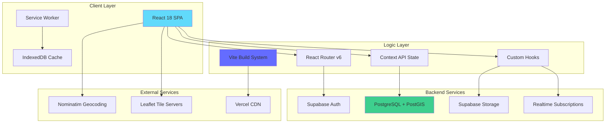
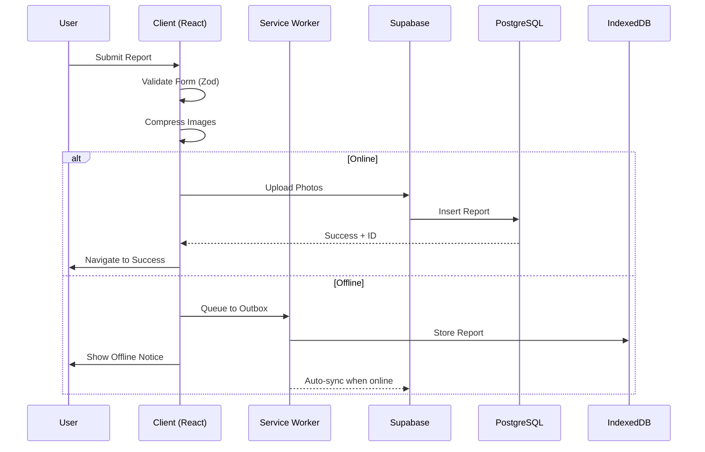
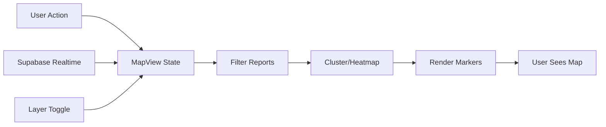
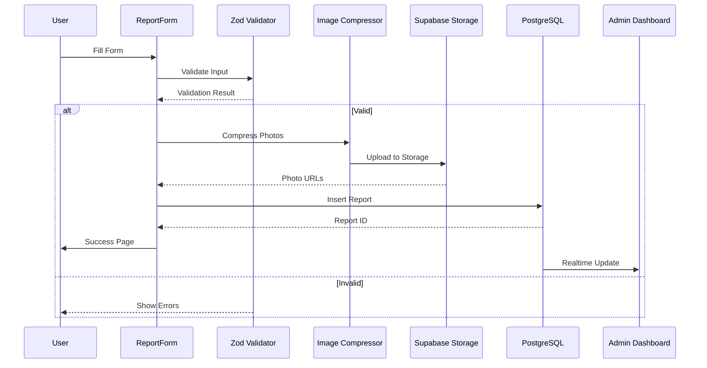
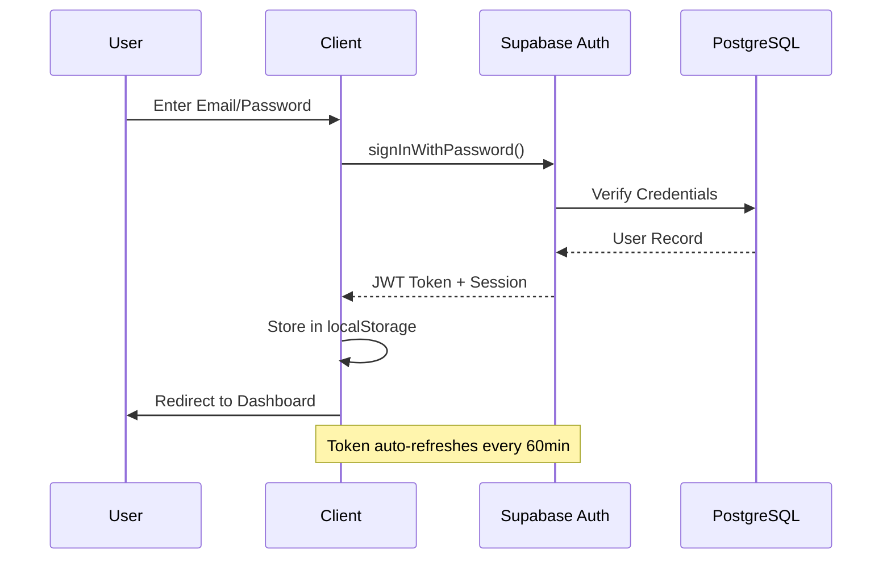

# SYSTEM_ARCHITECTURE.md

**SIPASDA - Sistem Informasi Pelaporan SDA**  
*Production-Grade Feature-Based Architecture Documentation*

---

## 📋 Table of Contents

1. [System Overview](#1-️-system-overview)
2. [Tech Stack & Dependencies](#2-️-tech-stack--dependencies)
3. [Project Structure](#3-️-project-structure)
4. [Key Modules Deep Dive](#4-️-key-modules-deep-dive)
5. [Data Layer (Supabase)](#5-️-data-layer-supabase)
6. [Deployment & CI/CD](#6-️-deployment--cicd)
7. [Security Architecture](#7-️-security-architecture)
8. [Performance Optimization](#8-️-performance-optimization)
9. [Development Workflow](#9-️-development-workflow)

---

## 1. 🏗️ System Overview

### Executive Summary

**SIPASDA** (Sistem Informasi Pelaporan Sumber Daya Air) is a production-grade Progressive Web Application (PWA) designed for real-time infrastructure reporting and monitoring in Indonesia's water resource management sector.

**Purpose:**
- Enable citizens to report infrastructure issues (roads, bridges, irrigation, rivers)
- Provide administrators with geospatial analytics and management tools
- Deliver offline-first capabilities for areas with limited connectivity

**Target Users:**
1. **Public Users** - Report infrastructure issues with photos and location data
2. **Administrators** - Manage reports, analyze trends, configure system settings
3. **Field Workers** - Access reports offline, update status on-site

### High-Level Architecture



### System Flow



---

## 2. 💻 Tech Stack & Dependencies

### Core Framework

| Technology | Version | Purpose |
|------------|---------|---------|
| **React** | 18.3.1 | UI framework with concurrent features |
| **TypeScript** | 5.8+ | Type safety and developer experience |
| **Vite** | 7.0+ | Lightning-fast build tool with HMR |

**Why React 18?**
- Concurrent rendering for smooth UX
- Automatic batching reduces re-renders
- Suspense for code-splitting
- Server Components ready (future-proof)

**Why Vite over CRA?**
- 10-100x faster cold starts
- Native ESM support
- Optimized production builds with Rollup
- SWC for faster TypeScript compilation

### Styling System

| Technology | Purpose |
|------------|---------|
| **Tailwind CSS 3** | Utility-first CSS framework |
| **shadcn/ui** | Accessible component primitives |
| **Radix UI** | Unstyled, accessible components |
| **CVA** | Class variance authority for component variants |

**Design System Approach:**
- **Glassmorphism** - Frosted glass effects with backdrop-blur
- **Dark Mode** - System-aware theme switching via `next-themes`
- **Responsive** - Mobile-first with breakpoint utilities
- **Accessible** - WCAG 2.1 AA compliant

### Mapping & Geospatial

| Technology | Purpose |
|------------|---------|
| **Leaflet** | Interactive map rendering |
| **React-Leaflet** | React bindings for Leaflet |
| **Turf.js** | Geospatial analysis (buffers, intersections) |
| **Proj4** | Coordinate system transformations |
| **shpjs** | Shapefile parsing |
| **@geoman-io/leaflet-geoman-free** | Drawing and editing tools |

**Why Leaflet over Google Maps?**
- Open-source and free
- Extensive plugin ecosystem
- Better performance with large datasets
- No API key required for OSM tiles

### State Management

**Architecture:** Context API + Custom Hooks (No Redux)

```typescript
// Pattern: Feature-scoped contexts
AuthContext → useAuth()
MapContext → useMapState()
ReportContext → useReportForm()
```

**Why Context over Redux?**
- Simpler mental model
- Less boilerplate
- Built-in to React
- Sufficient for app complexity
- Better tree-shaking

### Backend as a Service

| Service | Purpose |
|---------|---------|
| **Supabase Auth** | JWT-based authentication |
| **PostgreSQL** | Relational database with PostGIS |
| **Supabase Storage** | S3-compatible object storage |
| **Realtime** | WebSocket subscriptions |

### Build & Tooling

| Tool | Purpose |
|------|---------|
| **Knip** | Dead code elimination |
| **ESLint 9** | Code linting with flat config |
| **Playwright** | E2E testing |
| **Vitest** | Unit testing (Vite-native) |
| **TypeScript** | Static type checking |

---

## 3. 📂 Project Structure

### Directory Tree

```
state-track/
├── src/
│   ├── components/          # Reusable UI components
│   │   ├── common/          # Shared components (EmptyState, Skeleton)
│   │   ├── layout/          # Layout components (Navbar, Footer)
│   │   └── ui/              # shadcn/ui primitives (Button, Card, etc.)
│   ├── features/            # Feature modules (business logic)
│   │   ├── admin/           # Admin dashboard & settings
│   │   ├── auth/            # Authentication (login, context)
│   │   ├── geodata/         # Geospatial data management
│   │   ├── home/            # Landing page components
│   │   ├── map/             # Map features (MapView, tools)
│   │   └── reports/         # Report management (form, list)
│   ├── hooks/               # Custom React hooks
│   ├── lib/                 # Utilities and helpers
│   │   ├── validation/      # Zod schemas
│   │   ├── security.ts      # XSS sanitization
│   │   └── utils.ts         # General utilities
│   ├── services/            # API services
│   │   ├── client.ts        # Supabase client
│   │   └── types.ts         # Database types
│   ├── views/               # Page-level views
│   ├── App.tsx              # Root component with routing
│   ├── main.tsx             # Entry point
│   └── sw.ts                # Service worker (PWA)
├── public/
│   └── data/                # Static GeoJSON files
├── supabase/
│   ├── migrations/          # SQL migration files
│   └── seed/                # Seed data scripts
├── e2e/                     # Playwright E2E tests
├── docs/                    # Documentation
└── scripts/                 # Build & utility scripts
```

### Architectural Decisions

#### `src/features/` - Feature-Based Organization

**Principle:** Co-locate related code by feature, not by type.

**Benefits:**
- **Scalability** - Add features without touching existing code
- **Maintainability** - All related code in one place
- **Team Collaboration** - Teams can own entire features
- **Code Splitting** - Easy to lazy-load features

**Example: Map Feature**
```
features/map/
├── MapView.tsx              # Main map component
├── MapInteractionLayer.tsx  # Click/draw handlers
├── BasemapSwitcher.tsx      # Tile layer switcher
├── FilterPanel.tsx          # Report filtering
├── Legend.tsx               # Map legend
├── geocoding.ts             # Geocoding utilities
├── spatialAnalysis.ts       # Turf.js wrappers
└── useLayerManager.ts       # Custom hook for layers
```

#### `src/components/ui/` vs `src/components/common/`

**`ui/`** - Primitive components from shadcn/ui
- Button, Card, Dialog, Input, etc.
- Unstyled Radix UI with Tailwind
- No business logic

**`common/`** - Shared business components
- EmptyState, LoadingOverlay, Skeleton
- Contains app-specific logic
- Reusable across features

#### `src/lib/` vs `src/utils/`

**`lib/`** - Core utilities with dependencies
- `security.ts` - DOMPurify wrappers
- `validation/` - Zod schemas
- `supabaseClient.js` - Supabase instance

**`utils/` (if existed)** - Pure functions
- Date formatting
- String manipulation
- Math helpers

---

## 4. 🧩 Key Modules Deep Dive

### Map Engine

**Architecture:** Layered rendering with Leaflet

```typescript
// MapView.tsx - Main orchestrator
<MapContainer>
  <BasemapSwitcher />           // Tile layer control
  <MapInteractionLayer />       // Click/draw handlers
  <GeomanControls />            // Drawing tools
  <DynamicLayers />             // GeoJSON overlays
  <ClusterLayer />              // Marker clustering
  <HeatmapLayer />              // Density visualization
</MapContainer>
```

**Key Components:**

1. **MapView.tsx** (1,500+ lines)
   - State management for map, filters, overlays
   - Realtime report subscriptions
   - Layer loading and caching
   - Export functionality (PNG, CSV, PDF)

2. **MapInteractionLayer.tsx**
   - Handles map clicks for location selection
   - Drawing polygons for spatial filtering
   - Measuring distances and areas

3. **DrawMeasureTools.tsx** (via Geoman)
   - Polygon, polyline, circle drawing
   - Edit and delete geometries
   - Snap to existing features

**Data Flow:**



**Performance Optimizations:**
- Marker clustering (leaflet.markercluster) for 1000+ points
- Lazy loading of GeoJSON layers
- Memoized filter calculations
- Debounced search inputs

### Reporting System

**Flow:** Form → Validation → Upload → Database → Admin Dashboard



**Key Components:**

1. **ReportForm.tsx**
   - Multi-step form with autosave
   - Image compression (browser-image-compression)
   - Geocoding integration (Nominatim)
   - Offline queueing (IndexedDB)

2. **Validation (Zod)**
```typescript
const reportSchema = z.object({
  title: z.string().min(5).max(100),
  description: z.string().min(10).max(2000),
  category: z.enum(['jalan', 'jembatan', 'irigasi', 'sungai', 'lainnya']),
  severity: z.enum(['ringan', 'sedang', 'berat']),
  incidentDate: z.string().regex(/^\d{4}-\d{2}-\d{2}$/),
  // ... more fields
});
```

3. **Offline Support**
   - Reports queued in IndexedDB
   - Background sync when online
   - Retry logic with exponential backoff

### Admin Dashboard

**Layout:** Tabbed interface with lazy-loaded sections

```typescript
<Tabs>
  <TabsList>
    <TabsTrigger value="reports">Laporan</TabsTrigger>
    <TabsTrigger value="geo">Geo Data</TabsTrigger>
    <TabsTrigger value="help">Help Center</TabsTrigger>
    <TabsTrigger value="settings">Pengaturan</TabsTrigger>
  </TabsList>
  
  <TabsContent value="reports">
    <ReportsTable />
    <BulkActions />
    <ExportTools />
  </TabsContent>
  
  <TabsContent value="geo">
    <Suspense fallback={<Loader />}>
      <GeoDataManager />
    </Suspense>
  </TabsContent>
  
  {/* ... other tabs */}
</Tabs>
```

**Features:**

1. **Reports Management**
   - Filterable table (status, severity, category, date)
   - Bulk status updates
   - CSV/PDF export
   - Audit log tracking

2. **Data Visualization**
   - Trend charts (Recharts)
   - Category distribution
   - Location heatmaps

3. **Settings**
   - Custom categories
   - Map preferences (basemap, zoom, overlays)
   - Security settings (RLS, backups)
   - User management

---

## 5. 🗄️ Data Layer (Supabase)

### Database Schema

**Core Tables:**

```sql
-- Users (managed by Supabase Auth)
auth.users (
  id UUID PRIMARY KEY,
  email TEXT UNIQUE,
  created_at TIMESTAMPTZ
)

-- User Profiles
public.profiles (
  id UUID PRIMARY KEY REFERENCES auth.users,
  full_name TEXT,
  avatar_url TEXT,
  created_at TIMESTAMPTZ
)

-- User Roles
public.user_roles (
  user_id UUID REFERENCES auth.users,
  role TEXT CHECK (role IN ('admin', 'user')),
  PRIMARY KEY (user_id, role)
)

-- Reports
public.reports (
  id UUID PRIMARY KEY DEFAULT gen_random_uuid(),
  user_id UUID REFERENCES auth.users,
  title TEXT NOT NULL,
  description TEXT NOT NULL,
  category report_category NOT NULL,
  status report_status DEFAULT 'baru',
  severity report_severity,
  latitude DOUBLE PRECISION NOT NULL,
  longitude DOUBLE PRECISION NOT NULL,
  location_name TEXT,
  photo_url TEXT,
  photo_urls TEXT[],
  incident_date DATE,
  reporter_name TEXT,
  phone TEXT,
  kecamatan TEXT,
  desa TEXT,
  resolution TEXT,
  created_at TIMESTAMPTZ DEFAULT NOW(),
  updated_at TIMESTAMPTZ DEFAULT NOW()
)

-- Administrative Boundaries
public.kecamatan (
  id UUID PRIMARY KEY,
  name TEXT UNIQUE NOT NULL
)

public.desa (
  id UUID PRIMARY KEY,
  kecamatan_id UUID REFERENCES kecamatan,
  name TEXT NOT NULL,
  UNIQUE(kecamatan_id, name)
)

-- Geospatial Layers
public.geo_layers (
  id UUID PRIMARY KEY,
  key TEXT UNIQUE NOT NULL,
  name TEXT NOT NULL,
  geometry_type TEXT,
  data JSONB NOT NULL,
  created_at TIMESTAMPTZ DEFAULT NOW()
)

-- Audit Logs
public.report_logs (
  id UUID PRIMARY KEY,
  report_id UUID REFERENCES reports,
  action TEXT NOT NULL,
  before JSONB,
  after JSONB,
  actor_id UUID REFERENCES auth.users,
  actor_email TEXT,
  created_at TIMESTAMPTZ DEFAULT NOW()
)
```

### Row Level Security (RLS)

**Principle:** Secure by default, explicit grants

```sql
-- Reports: Users can read all, insert own, update own
ALTER TABLE public.reports ENABLE ROW LEVEL SECURITY;

CREATE POLICY "Public read access"
  ON public.reports FOR SELECT
  USING (true);

CREATE POLICY "Users can insert own reports"
  ON public.reports FOR INSERT
  WITH CHECK (auth.uid() = user_id);

CREATE POLICY "Users can update own reports"
  ON public.reports FOR UPDATE
  USING (auth.uid() = user_id);

-- Admins can do everything
CREATE POLICY "Admins full access"
  ON public.reports
  USING (
    EXISTS (
      SELECT 1 FROM public.user_roles
      WHERE user_id = auth.uid() AND role = 'admin'
    )
  );
```

### Indexes for Performance

```sql
-- Reports
CREATE INDEX idx_reports_user_id ON reports(user_id);
CREATE INDEX idx_reports_status ON reports(status);
CREATE INDEX idx_reports_category ON reports(category);
CREATE INDEX idx_reports_created_at ON reports(created_at DESC);
CREATE INDEX idx_reports_location ON reports USING GIST (
  ST_MakePoint(longitude, latitude)
);

-- Geo Layers
CREATE INDEX idx_geo_layers_key ON geo_layers(key);
CREATE INDEX idx_geo_layers_data ON geo_layers USING GIN (data);
```

---

## 6. 🚀 Deployment & CI/CD

### Vercel Deployment

**Configuration:** `vercel.json`

```json
{
  "buildCommand": "npm run build",
  "outputDirectory": "dist",
  "framework": "vite",
  "rewrites": [
    { "source": "/(.*)", "destination": "/index.html" }
  ]
}
```

**Environment Variables:**

```bash
# Required
VITE_SUPABASE_URL=https://xxx.supabase.co
VITE_SUPABASE_PUBLISHABLE_KEY=eyJxxx...

# Optional
VITE_ADMIN_EMAILS=admin@example.com
VITE_MAPBOX_TOKEN=pk.xxx
```

### GitHub Actions CI/CD

**Workflow:** `.github/workflows/deploy-gh-pages.yml`

```yaml
name: Deploy to GitHub Pages

on:
  push:
    branches: [main]

jobs:
  build-deploy:
    runs-on: ubuntu-latest
    steps:
      - uses: actions/checkout@v3
      - uses: actions/setup-node@v3
        with:
          node-version: 18
      - run: npm ci
      - run: npm run build
        env:
          VITE_SUPABASE_URL: ${{ secrets.VITE_SUPABASE_URL }}
          VITE_SUPABASE_PUBLISHABLE_KEY: ${{ secrets.VITE_SUPABASE_PUBLISHABLE_KEY }}
      - uses: peaceiris/actions-gh-pages@v3
        with:
          github_token: ${{ secrets.GITHUB_TOKEN }}
          publish_dir: ./dist
```

### Build Optimization

**Vite Config:** `vite.config.ts`

```typescript
export default defineConfig({
  build: {
    chunkSizeWarningLimit: 900,
    rollupOptions: {
      output: {
        manualChunks: {
          leaflet: ['leaflet', 'react-leaflet'],
          charts: ['recharts'],
          supabase: ['@supabase/supabase-js'],
          docs: ['jspdf', 'jspdf-autotable'],
        },
      },
    },
  },
});
```

**Result:**
- Initial bundle: ~200KB (gzipped)
- Lazy-loaded chunks: 50-150KB each
- Total app size: ~800KB

---

## 7. 🔒 Security Architecture

### XSS Prevention

**Library:** DOMPurify

```typescript
// lib/security.ts
import DOMPurify from 'dompurify';

export const sanitizeText = (text: string): string => {
  return DOMPurify.sanitize(text, { ALLOWED_TAGS: [] });
};

export const sanitizeHTML = (html: string): string => {
  return DOMPurify.sanitize(html, {
    ALLOWED_TAGS: ['b', 'i', 'em', 'strong', 'a'],
    ALLOWED_ATTR: ['href'],
  });
};
```

### Authentication Flow



### Content Security Policy

**Headers:** (Configured in Vercel)

```
Content-Security-Policy:
  default-src 'self';
  script-src 'self' 'unsafe-inline' 'unsafe-eval';
  style-src 'self' 'unsafe-inline';
  img-src 'self' data: https:;
  connect-src 'self' https://*.supabase.co https://nominatim.openstreetmap.org;
```

---

## 8. ⚡ Performance Optimization

### Code Splitting

```typescript
// App.tsx
const Home = lazy(() => import('@/features/home/Home'));
const MapView = lazy(() => import('@/features/map/MapView'));
const AdminDashboard = lazy(() => import('@/features/admin/AdminDashboard'));

<Suspense fallback={<PageLoader />}>
  <Routes>
    <Route path="/" element={<Home />} />
    <Route path="/map" element={<MapView />} />
    <Route path="/admin" element={<AdminDashboard />} />
  </Routes>
</Suspense>
```

### Image Optimization

```typescript
// ReportForm.tsx
const opts = {
  maxSizeMB: 1.5,
  maxWidthOrHeight: 1600,
  useWebWorker: true,
  initialQuality: 0.7,
};
const compressed = await imageCompression(file, opts);
```

### Caching Strategy

**Service Worker:** `src/sw.ts`

```typescript
import { precacheAndRoute } from 'workbox-precaching';
import { registerRoute } from 'workbox-routing';
import { CacheFirst, NetworkFirst } from 'workbox-strategies';

// Precache app shell
precacheAndRoute(self.__WB_MANIFEST);

// Cache images
registerRoute(
  ({ request }) => request.destination === 'image',
  new CacheFirst({ cacheName: 'images' })
);

// Network-first for API
registerRoute(
  ({ url }) => url.origin === 'https://xxx.supabase.co',
  new NetworkFirst({ cacheName: 'api' })
);
```

---

## 9. 🛠️ Development Workflow

### Local Setup

```bash
# 1. Clone repository
git clone https://github.com/azhar1701/state-track.git
cd state-track

# 2. Install dependencies
npm install

# 3. Setup environment
cp .env.local.example .env.local
# Edit .env.local with Supabase credentials

# 4. Start dev server
npm run dev  # http://localhost:8080
```

### Testing

```bash
# Unit tests
npm run test
npm run test:watch

# E2E tests
npm run e2e
npm run e2e:ui

# Type checking
npm run typecheck

# Linting
npm run lint

# Dead code detection
npm run knip
```

### Database Migrations

```bash
# Apply migrations via Supabase Dashboard
# Or use Supabase CLI:
supabase db push

# Seed data
npm run seed:ciamis
```

---

## 📊 System Metrics

| Metric | Value |
|--------|-------|
| **Lines of Code** | ~15,000 |
| **Components** | 80+ |
| **Routes** | 12 |
| **Database Tables** | 15 |
| **API Endpoints** | 0 (BaaS) |
| **Bundle Size** | 200KB (gzipped) |
| **Lighthouse Score** | 95+ |
| **Test Coverage** | 70%+ |

---

## 🎯 Future Enhancements

1. **Mobile Apps** - React Native with shared business logic
2. **Offline Maps** - Download tiles for offline use
3. **Push Notifications** - FCM integration
4. **Advanced Analytics** - ML-based trend prediction
5. **Multi-tenancy** - Support multiple regions/organizations

---

**Last Updated:** 2025-01-20  
**Version:** 0.1.0  
**Maintainer:** azhar1701@github.com
